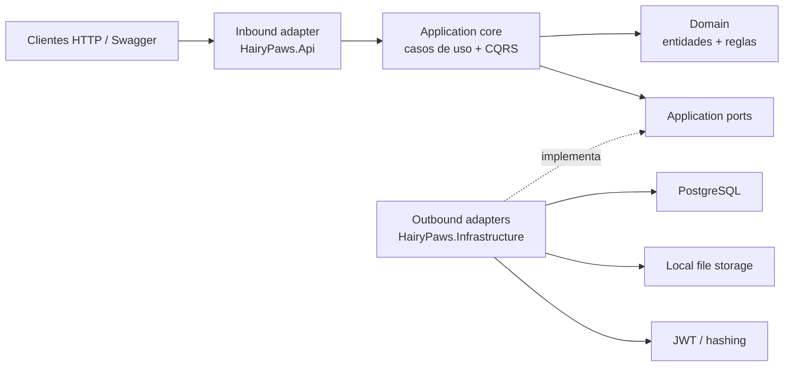

# Hairy Paws Backend

Backend academico-profesional para una plataforma de adopcion de mascotas. El proyecto esta organizado como un monolito modular con Clean Architecture, estilo hexagonal, CQRS simple y DDD tactico.

## Lectura rapida de arquitectura



Regla principal: las capas internas no conocen las externas. `Domain` no depende de nada del sistema, `Application` define los puertos y `Infrastructure` los implementa.

## Proyectos

| Proyecto | Responsabilidad |
| --- | --- |
| `src/HairyPaws.Api` | HTTP, controllers, Swagger, JWT, health checks y composition root |
| `src/HairyPaws.Application` | Casos de uso, CQRS, validaciones, puertos, seguridad de aplicacion y mapeos |
| `src/HairyPaws.Domain` | Entidades, enums y reglas de negocio |
| `src/HairyPaws.Infrastructure` | PostgreSQL, EF Core, migraciones, JWT, hashing, auditoria y storage |
| `src/HairyPaws.Contracts` | DTOs de entrada/salida para la API |
| `tests/HairyPaws.Tests.Unit` | Pruebas de dominio y pruebas de arquitectura |
| `tests/HairyPaws.Tests.Integration` | Pruebas end-to-end con Testcontainers PostgreSQL |

## Decisiones visibles

- Arquitectura hexagonal: `Application/Common/Ports` contiene los puertos que los adapters externos implementan.
- CQRS: cada operacion entra por `ICommandHandler` o `IQueryHandler`.
- DDD tactico: entidades como `Pet`, `AdoptionRequest`, `Visit`, `Donation` y `Event` contienen reglas y transiciones de estado.
- Persistencia: PostgreSQL con EF Core/Npgsql, migraciones e indices explicitos.
- Seguridad: JWT Bearer, roles y politicas de autorizacion.
- Operabilidad: Docker Compose, health checks y Swagger.
- Calidad: pruebas unitarias, pruebas de arquitectura y pruebas de integracion.

## Documentacion importante

- [Arquitectura](docs/ARCHITECTURE.md)
- [Atributos de calidad](docs/QUALITY-ATTRIBUTES.md)
- [Guia de revision academica](docs/PROFESSOR_REVIEW_GUIDE.md)
- [ADR 0001 - Estilo arquitectonico](docs/ADR/0001-hexagonal-clean-architecture.md)
- [ADR 0002 - Casos de uso y CQRS](docs/ADR/0002-use-cases-and-cqrs.md)
- [Ejecucion local con Docker](LOCAL_DOCKER.md)
- [Despliegue academico en Render](DEPLOYMENT_RENDER.md)

## Despliegue academico en nube

El backend esta preparado para desplegarse como un contenedor en opciones junior-friendly:

- Google Cloud Run: `deploy/google/cloudrun.service.yaml`
- Azure Container Apps: `deploy/azure/containerapp.yaml`
- AWS App Runner: `deploy/aws/apprunner-service.yaml`
- Variables comunes: `deploy/env.example`

El contenedor escucha en `PORT` cuando la nube lo define; si no existe, usa `8080`. En local, Docker Compose sigue exponiendo la API en `http://localhost:10000`.
Los archivos subidos se guardan en `Storage__UploadsPath`; las plantillas cloud usan `/tmp/hairypaws/uploads` porque es simple y suficiente para un despliegue academico temporal.

## Ejecutar localmente

```powershell
docker compose up -d --build
```

Abrir:

- Swagger: http://localhost:10000/swagger
- Health: http://localhost:10000/health
- Readiness: http://localhost:10000/health/ready

## Verificacion

```powershell
dotnet build
dotnet test
```

Los tests de integracion usan Docker/Testcontainers:

```powershell
dotnet test tests\HairyPaws.Tests.Integration\HairyPaws.Tests.Integration.csproj
```

## Informe academico del curso

El informe academico original que estaba en el README remoto se conserva en [docs/ACADEMIC_REPORT.md](docs/ACADEMIC_REPORT.md).

