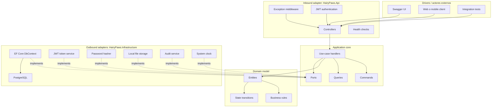
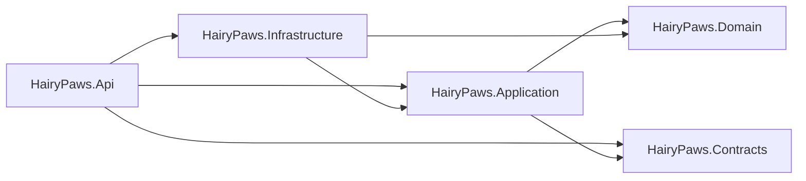
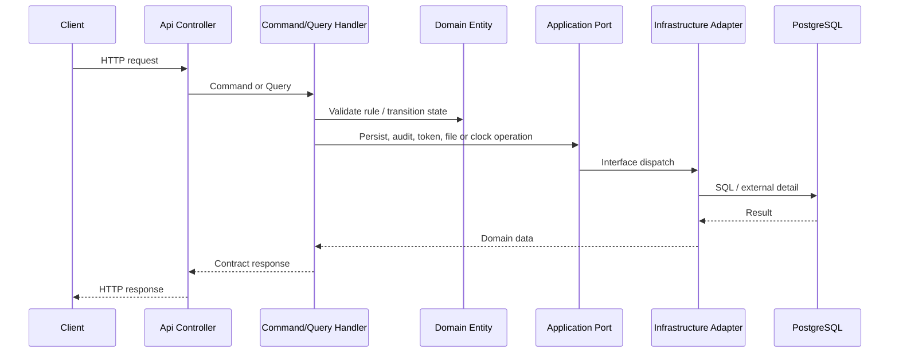

# Arquitectura del Backend

## Resumen

Hairy Paws Backend esta disenado como un monolito modular con Clean Architecture y estilo hexagonal. La aplicacion mantiene el dominio y los casos de uso en el centro, mientras que HTTP, base de datos, JWT, storage y reloj del sistema quedan como adapters externos.

## Vista hexagonal

## Regla de dependencias

`Domain` es el nucleo mas estable. `Application` orquesta casos de uso y define puertos. `Infrastructure` depende hacia adentro para implementar esos puertos. `Api` es el composition root que conecta todo.

## Flujo de una peticion

## Capas y responsabilidades

### Domain

Contiene entidades con comportamiento y reglas de negocio. Ejemplos:

- `Pet`: publicacion, archivo, adopcion pendiente y validacion minima antes de publicar.
- `AdoptionRequest`: envio, revision, aprobacion, rechazo, cancelacion, finalizacion y visitas.
- `Visit`: aprobacion, rechazo, cancelacion y completado.

El dominio evita depender de frameworks, base de datos o HTTP.

### Application

Contiene los casos de uso. Cada accion se modela como comando o query y se ejecuta mediante handlers:

- `ICommandHandler<TCommand, TResponse>`
- `ICommandHandler<TCommand>`
- `IQueryHandler<TQuery, TResponse>`

Tambien define puertos en `Application/Common/Ports`, por ejemplo:

- `IApplicationDbContext`
- `IJwtTokenService`
- `IPasswordHasher`
- `IFileStorageService`
- `ICurrentUserService`
- `IDateTimeProvider`
- `IAuditService`
- `INotificationService`

### Infrastructure

Implementa los puertos del core:

- `ApplicationDbContext` implementa `IApplicationDbContext`.
- `JwtTokenService` implementa `IJwtTokenService`.
- `PasswordHasherService` implementa `IPasswordHasher`.
- `LocalFileStorageService` implementa `IFileStorageService`.
- `AuditService` implementa `IAuditService`.
- `SystemDateTimeProvider` implementa `IDateTimeProvider`.

### Api

Es el adapter HTTP y composition root:

- Recibe HTTP requests.
- Aplica autenticacion y autorizacion.
- Traduce requests a commands/queries.
- Expone Swagger y health checks.
- Registra Application e Infrastructure en el contenedor DI.

## Nota de diseno

`IApplicationDbContext` es un puerto de persistencia con forma EF Core. Es una decision pragmatica para mantener consultas expresivas con LINQ, migraciones y pruebas de integracion reales. Si el proyecto creciera, el siguiente paso seria dividir este puerto en repositorios o query services por agregado para reducir todavia mas el acoplamiento a EF Core dentro de Application.

